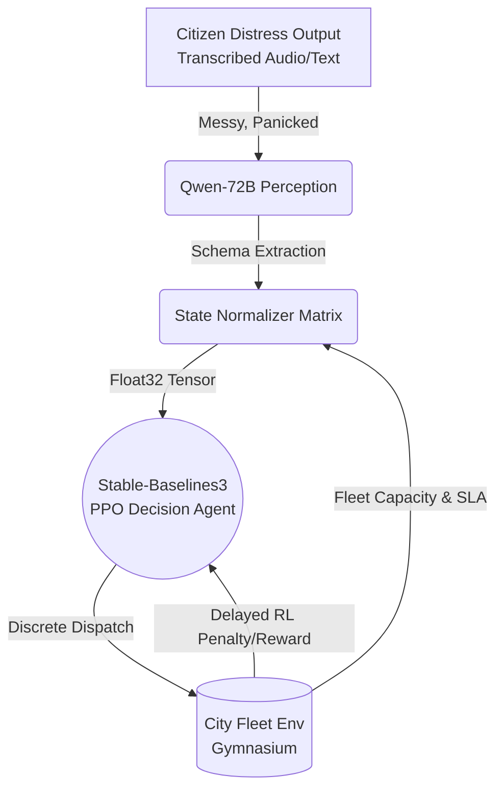

<div align="center">
  
</div>

# 🏛️ Civic Desk: Multi-Modal Agentic Dispatch
> **Next-Generation Heterogeneous Reinforcement Learning for Municipal Operations**


Welcome to **Civic Desk** — an advanced, production-grade municipal dispatch simulator. This platform solves the reliability gap in purely generative AI by employing a **Heterogeneous Reinforcement Learning Architecture**, blending the unparalleled reasoning of Large Language Models (LLMs) with the strict, mathematical capacity-planning capabilities of Proximal Policy Optimization (PPO) RL agents.

## ✨ The Problem & Our Solution
Generative AI acts as a brilliant "Perception" layer, decoding messy human context from calls or texts. However, LLMs hallucinate over multi-step timelines; they fail to remember that assigning a Water truck to a medium priority leak leaves the city vulnerable to critical main breaks hours later.

**Our AI splits into two specialized neural pathways:**
1. **The Perception Engine (Qwen-72B Instruct / Multimodal)**: Listens to incoming reports, standardizes unstructured, panicked emergency text (or transcribed audio) into strict JSON schema variables: `[Severity, Department Target]`.
2. **The Tactical Decision Array (PPO Gymnasium RL)**: We trained a policy network across tens of thousands of simulated shifts. It reads the LLM's state perception, analyzes current fleet logistics and SLAs, and executes discrete dispatch commands in milliseconds, completely eliminating logic hallucination.

## 🏆 OpenEnv Hackathon Architecture
Designed strictly against OpenEnv specifications, Civic Desk provides a unified interface:
- **`inference.py`**: The fully compliant entry point wrapper simulating the end-to-end task pipeline, producing compliant JSON states, and correctly firing `[START]`, `[STEP]`, and `[END]` lifecycle tokens.
- **Gymnasium Integration**: A robust `server/civic_desk_environment.py` adhering to OpenEnv testing benchmarks.

---

## 🚀 Quickstart & Operations

### 1. Installation
Install the required packages to establish the PPO neural network and dashboard dependencies:
```bash
pip install -r requirements.txt
pip install -e "."
```

### 2. Live Operations Dashboard (Streamlit)
To visualize the Heterogeneous AI stack in action, launch the command center:
```bash
streamlit run dashboard.py
```
> **Immersive Glassmorphic UI**: Watch the RL agent continuously process active anomalies across Police, Public Works, Sanitation, and Water departments simultaneously along a dynamic continuous timeline.

### 3. Run Benchmark Inference
Execute the auto-grader compliant validation script:
```bash
python inference.py
```

## 🏗️ Neural Infrastructure Pipeline



## 📈 Scalability & Impact
Civic Desk isn't just an RL wrapper. It demonstrates **Agentic Resilience**. By decoupling natural language understanding from mathematical constraint-solving, this setup can securely scale to manage automated EMS dispatch, public transit scheduling, or electrical grid load-balancing—representing the true end-state of enterprise AI.

---
<div align="center">
  <i>Engineered for the OpenEnv Hackathon — Forging the Future of Smart Cities</i>
</div>
